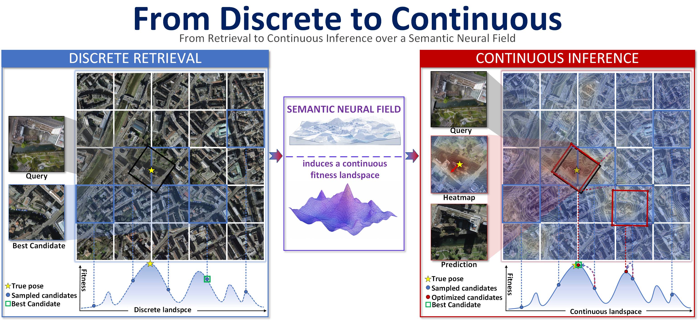

# ContinuLoc
<p align="center">
  
</p>

Continuous Pose Inference over Neural Fields for UAV Geo-Localization.

ContinuLoc formulates cross-view UAV geo-localization as continuous 4DoF pose inference over an observation-scene fitness landscape. The system has three main components aligned with the paper:

- **Landscape-Aware Representation Learning** learns 4DoF pose-sensitive UAV and reference descriptors.
- **Semantic Neural Field as a Continuous Pose Index** distills pose-conditioned scene evidence into a compact neural field.
- **Hierarchical Pose Inference in Continuous Pose Space** searches the induced fitness landscape from global exploration to local refinement.

The ContinuScenes dataset release is in progress and will be made available soon.

## Setup

Install the project dependencies in your preferred Python environment. The implementation expects PyTorch and the dependencies used by the visual backbone, SALAD aggregator, and INGP modules.

If Kaolin Wisp is installed outside this repository, expose it with:

```bash
export KAOLIN_WISP_ROOT=/path/to/kaolin-wisp
```

Edit the YAML files under `trainer_depends/configs/` to point to your dataset, checkpoint, and output locations before running experiments.

## Landscape-Aware Representation Learning

Train the 4DoF-aware observation representation:

```bash
python trainers/stage1_visual_encoder_minimal.py \
  --p_yaml trainer_depends/configs/stage1_visual_encoder_wingtra.yaml
```

Evaluate the learned representation with a reference gallery:

```bash
python trainers/stage1_visual_encoder_minimal.py \
  --p_yaml trainer_depends/configs/stage1_visual_encoder_wingtra.yaml \
  --test_only true
```

## Semantic Neural Field as a Continuous Pose Index

Train the semantic neural field to regress descriptors from 4DoF pose coordinates:

```bash
python trainers/stage2_INGP_minimal.py \
  --p_yaml trainer_depends/configs/stage2_INGP_wingtra.yaml
```

Evaluate the learned field:

```bash
python trainers/stage2_INGP_minimal.py \
  --p_yaml trainer_depends/configs/stage2_INGP_wingtra.yaml \
  --test_only true
```

## Hierarchical Pose Inference in Continuous Pose Space

Run continuous pose inference with the trained representation and semantic field:

```bash
python trainers/stage3_ingp_inferencer_minimal.py \
  --stage3_yaml trainer_depends/configs/stage3_ingp_minimal.yaml \
  --stage2_opts_yaml trainer_depends/configs/stage2_INGP_wingtra.yaml
```

The inference entrypoint reports progressive recall for global exploration, population contraction, and local refinement.

## Configuration

Common configuration files:

- `trainer_depends/configs/stage1_visual_encoder_wingtra.yaml`
- `trainer_depends/configs/stage1_visual_encoder_visloc.yaml`
- `trainer_depends/configs/stage2_INGP_wingtra.yaml`
- `trainer_depends/configs/stage2_INGP_visloc.yaml`
- `trainer_depends/configs/stage3_ingp_minimal.yaml`
- `trainer_depends/configs/stage3_recall_thresholds.yaml`

Use the `wingtra` or `visloc` variants according to the scene split you want to run.
